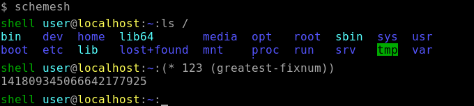
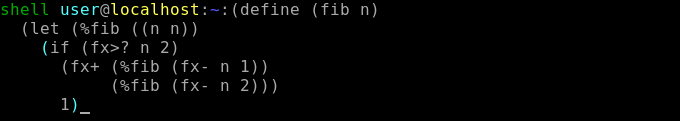

# schemesh
## Fusion between a Unix shell and a Lisp REPL

Schemesh is an interactive shell scriptable in Lisp.

It is primarily intended as a user-friendly Unix login shell, replacing bash, zsh, pdksh etc.

As such, it supports interactive line editing, autocompletion, history and the familiar Unix shell syntax:
it can start commands, including redirections, pipelines, job concatenation with `;` `&&` `||`,
groups surrounded by `{ }`, subshells surrounded by `[ ]`, and manage foreground/background jobs.

For more complex tasks, it seamlessly integrates a full Lisp REPL backed by Chez Scheme.

Schemesh can be used as:
* a replacement for traditional interactive Unix shell, as for example bash/zsh/pdksh etc.

* a Unix shell scriptable in Chez Scheme.

* a Scheme REPL with additional syntax and functions to start, redirect and manage Unix processes.

* a Scheme library for starting, redirecting and managing Unix processes.

For scripting and serious programming, schemesh completely replaces the slow, clumsy and error-prone
scripting language of a traditional shell (yes, the author has opinions) with a full-featured Lisp REPL,
backed by the fast and open-source Chez Scheme compiler that generates highly optimized native code.

### How to use

As a traditional Unix shell: type a command and press Enter.<br/>
As a Lisp REPL: type an expression starting with `(` and press Enter.<br/>


If the parentheses/braces/brackets/quotes are balanced,<br/>
schemesh will execute the command and show any failure, or evaluate the expression and pretty-print its value.

If the parentheses/braces/brackets/quotes are *not* balanced,<br/>
schemesh will create a second line where you can continue typing.<br/>
You can move between lines with the cursor keys, and use all the classical line-editing features including cut-and-paste.<br/>


Switching between shell syntax and Lisp syntax is extremely simple, and can be done basically everywhere:
* open parenthesis `(` temporarily switches to Lisp syntax until the corresponding `)`.

* open brace i.e. `{` temporarily switches to shell syntax until the corresponding `}`.

* open bracket i.e. `[` starts a new sub-form in current syntax until the corresponding `]`.<br/>
  If found in Lisp syntax, it is equivalent to `(`.<br/>
  If found in shell syntax, it is similar to `{` with the difference that commands will be executed in a subshell.

* the directives `#!scheme` `#!chezscheme` and `#!r6rs` temporarily switch to Scheme syntax
  (with the appropriate flavor) until the end of current `( )`, `[ ]` or `{ }`.<br/>
  If entered at top level, they change the default syntax until another directive is entered at top level.

* the directive `#!shell` temporarily switches to shell syntax until the end of current `( )`, `[ ]` or `{ }`.<br/>
  If entered at top level, it changes the default syntax until another directive is entered at top level.

* shell syntax creates first-class Lisp `sh-job` objects, which can be started/stopped/managed from both syntaxes.

* `sh-job` objects are discoverable and pretty-printable:<br/>
  `(values '{SOME-SHELL-SYNTAX})` shows how shell syntax is converted to `shell...` macros,<br/>
  `(expand '{SOME-SHELL-SYNTAX})` shows how `shell...` macros are expanded to `sh...` functions for creating jobs,<br/>
  `(values  {SOME-SHELL-SYNTAX})` - *without* quotes - pretty-prints the created `sh-job` objects.

The most common mechanisms to start/stop/manage jobs from shell syntax are:
* CTRL+C      interrupt the current foreground job
* CTRL+Z      suspend the current foreground job
* `bg job-id` resume a job in background
* `fg job-id` resume a job in foreground

The analogous job control mechanisms from Scheme syntax are:
* CTRL+C      as above
* CTRL+Z      as above
* `(sh-start job-object)` start a job in background, return immediately
* `(sh-run/i job-object)` start a job in foreground, wait until job finishes or is suspended
* `(sh-run   job-object)` start a job in foreground, wait until job finishes
* `(sh-bg    job-or-id)` resume a job in background, return immediately
* `(sh-fg    job-or-id)` resume a job in foreground, wait until job finishes or is suspended
* `(sh-wait  job-or-id)` resume a job in foreground, wait until job finishes

Some more advanced Scheme functions:
* `(sh-run/string job-object)` start a job in foreground, wait until job finishes, return its output as a Scheme string
* `(sh-start/fd-stdout job-object)` start a job in background, return a file descriptor fixnum for reading its standard output - for example with `(open-fd-input-port fd)`

### Examples

You can mix shell command execution with Lisp control structures, loops and functions as for example:
```lisp
(if (some_expression arg1 (sub_expression2))
  (sh-run/i {then_run_this_command foo bar $VAR})
  (sh-run/i {else_run_this_command foo bar $VAR}))
```
instead of typical shell syntax, which is error prone as it's based on string expansion and splitting,
and geared toward command execution, as for example:
```shell
# Note: this is POSIX shell syntax for `if-then-else`. It will NOT work in schemesh.
if some_command "$arg1" "$(sub_command)"
then
  then_run_this_command foo bar $VAR
else
  else_run_this_command foo bar $VAR
fi
```
more examples mixing shell and Lisp syntax:
```shell
find (lisp-function-returning-some-string) -type f | grep ^lib | wc -l &
fg 1
```

```lisp
(define job {ls -l > ls.out || echo "ls failed"})
(sh-start job)
(sh-fg job)
```

```lisp
(define txt (sh-run/string {git log}))
(display txt)
```

a slighty more complex example - uses several additional functions and macros provided by schemesh
```lisp
(import (schemesh all))

(for ((f (in-list (sh-run/string-split-after-nuls {find -type f -print0}))))
  (file-rename f (string-replace f ".old" ".bak")))
```

### Features
- [x] REPL with multi-line editing and parentheses highlighting
- [x] dual syntax parsing, allows mixing Scheme and shell expressions
- [x] shortcuts to execute commands by pressing a single key: KP/ KP* KP-
- [x] history searchable with PageUp and PageDown keys
- [x] cut-and-paste
- [x] context-sensitive autocompletion - some improvements pending
- [x] UTF-8b for losslessly converting byte sequences that are not valid UTF-8
- [x] shell commands, including `;` `&` `!` `&&` `||` `{` `}` `[` `]`
- [x] shell job control
- [x] shell aliases
- [x] shell builtins
- [x] shell environment variables
- [x] shell pipelines `|` `|&`
- [x] shell redirections `<` `>` `<>` `>>` `<&` `>&` `$()` ``` `` ```
- [x] shell wildcard expansion
- [x] each job has its own current directory and environment variables,
      initially inherited from parent job
- [x] customizable prompt, set by environment variable `$SCHEMESH_PS1`
- [x] if the directory `$HOME/.cache/schemesh/` exists,<br/>
      history is automatically saved to and loaded from a file `history.txt` inside such directory
- [x] if the file `$HOME/.config/schemesh/repl_init.ss` exists,<br/>
      it is automatically executed when starting the REPL
- [x] if the file `$HOME/.config/schemesh/repl_quit.ss` exists,<br/>
      it is automatically executed when exiting the REPL


## Build instructions

On Debian Linux, execute the following commands:
```shell
sudo apt update
sudo apt install build-essential chezscheme-dev liblz4-dev libncurses-dev git uuid-dev zlib1g-dev
git clone https://github.com/cosmos72/schemesh
cd schemesh
make -j
sudo make install
```

On Fedora Linux:
```shell
sudo dnf install gcc make chez-scheme-devel lz4-devel ncurses-devel git libuuid-devel zlib-devel
git clone https://github.com/cosmos72/schemesh
cd schemesh
make -j
sudo make install
```

For other systems, the instructions above can (hopefully) be adapted as needed.

If all went well, you can execute `schemesh`

In case your environment variable `$PATH` does not contain `/usr/local/bin`,
the command `schemesh` will not suffice - you will need to run `/usr/local/bin/schemesh`

Troubleshooting:

if `make -j` fails, a possible error is that it fails to autodetect Chez Scheme installation directory.
In such case you can manually specify it, as for example `make -j CHEZ_SCHEME_DIR="/usr/local/lib/csv10.0.0/ta6le"`

## RECENT CHANGES

See [doc/recent_changes.md](doc/recent_changes.md)

## FREQUENTLY ASKED QUESTIONS

* how does schemesh differ from other Lisp-based shells as
  [Scsh](https://scsh.net/),
  [Rash](http://rash-lang.org/),
  [Eshell](https://www.emacswiki.org/emacs/CategoryEshell#Eshell),
  or (pick favorite shell) ?

  In extreme summary:
  none of them have job control, i.e. the ability to suspend a job and resume it in the background or foreground;
  some also have additional limitations.

  Scsh lacks line editing, autocompletion and shell-like syntax - see [Scsh Reference manual - Caveats](https://scsh.net/docu/html/man-Z-H-2.html#node_sec_1.4)

  Eshell runs *inside* Emacs, so it's difficult to use as a login shell.

  For more details, see [doc/comparison_with_other_shells.md](doc/comparison_with_other_shells.md)


## TO DO

* autocomplete shell paths and scheme strings: unescape stems before searching for completions, escape completions
* autocomplete shell paths and scheme strings: when autocompleting inside single or double quotes, the stem starts at the quotes.
* autocomplete shell paths starting with ~
* maybe add missing shell builtins "kill"
* implement function `(string->sh-patterns)`
